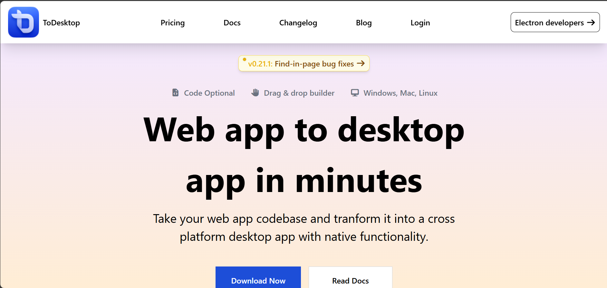
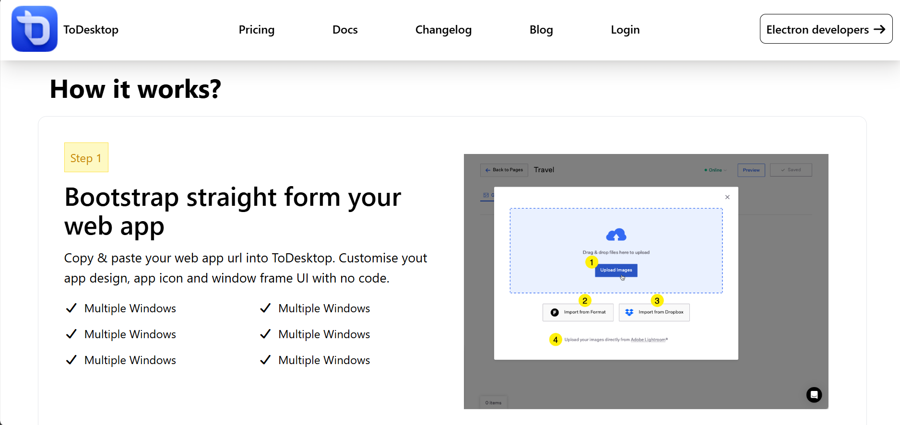
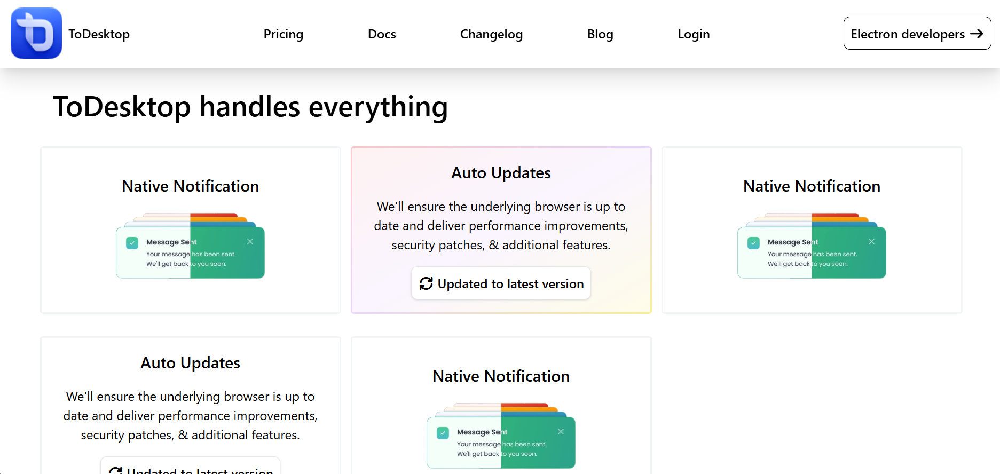
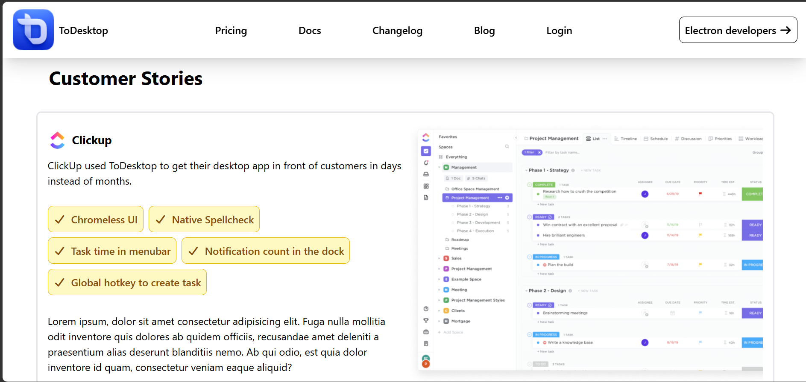
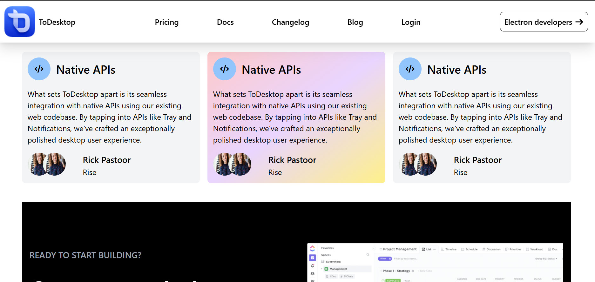
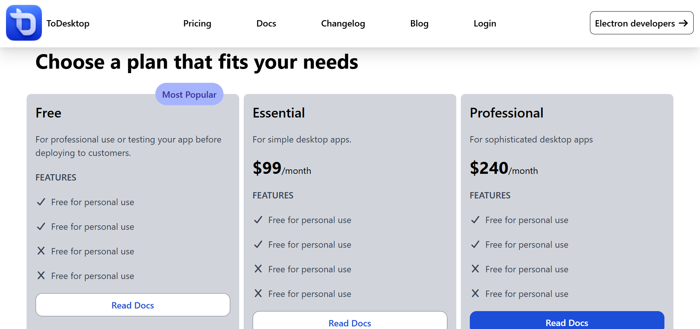

# 🚀 ToDesktop Clone

A modern, fully responsive ToDesktop website clone built using HTML, CSS, JavaScript, and Tailwind CSS.  
This project is focused on recreating a professional SaaS landing page UI with clean design and responsiveness.

---

## 🌐 Live Demo

https://syedafatima-webdev.github.io/ToDesktop-website-clone/

---

## 📸 Project Preview

Add your screenshot here:

---

## ⚙️ Tech Stack

- HTML5  
- CSS3  
- JavaScript  
- Tailwind CSS  

---

## ✨ Features

- Fully responsive design for all screen sizes  
- Modern SaaS-style landing page layout  
- Clean UI with structured sections  
- Smooth scrolling and interactive elements  
- Tailwind CSS utility-first styling  
- Lightweight and fast performance  

---

## 📚 What I Learned

- How to build responsive layouts using Tailwind CSS  
- Structuring real-world landing page designs  
- Improving frontend UI/UX skills  
- Writing clean and maintainable code  
- Handling responsiveness across devices  

---

## 📁 Project Structure

📦 todesktop-clone  
├── new.html   
├── script.js  
├── src/  
├── assets/  
├── images/  
└── README.md  

---

## 🚀 Future Improvements

- Add dark mode 🌙  
- Improve animations and transitions  
- Optimize performance  
- Add backend integration in future versions  

---

## 👩‍💻 Author

Fatima Zahra  
Frontend Developer | Graphic Designer | AI/ML Enthusiast  

---

## ⭐ Support

If you like this project, please consider starring the repository and sharing feedback.
